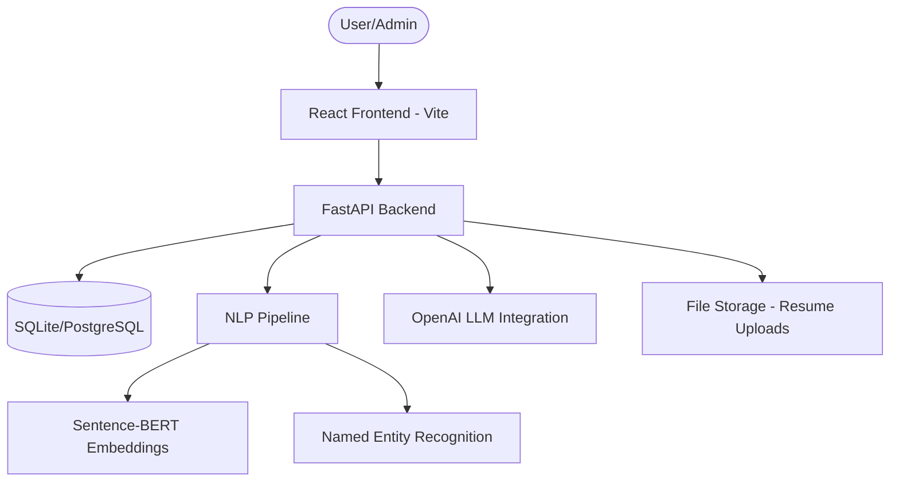

# System Design & Architecture

## High-Level Architecture
The platform follows a modern decoupled architecture with a React frontend, a FastAPI backend, and a PostgreSQL/SQLite database.

## Component Breakdown

### 1. Frontend (React + Vite)
- **Framework**: React 18 with Vite for fast builds.
- **Routing**: `react-router-dom` for navigation.
- **State Management**: `react-query` for server-state and synchronization.
- **Key Modules**:
  - `AdminDashboard.jsx`: Management of users and recruiters.
  - `Matches.jsx`: Visualization of job-fit scores.
  - `JobPosting.jsx`: Input for job requirements.
  - `CandidateDashboard.jsx`: Resume management interface.

### 2. Backend (FastAPI)
- **Framework**: FastAPI (Asynchronous Python).
- **ORM**: SQLAlchemy for database interaction.
- **Task Management**: Scalable service layer for heavy processing.
- **Key Services**:
  - `MatchingEngine`: Computes multi-factor scores (Semantic, Skills, Experience).
  - `NLPProcessor`: Conducts text cleaning, extraction, and embedding generation.
  - `LLMService`: Interfaces with OpenAI for summaries and explanations.
  - `ResumeParser`: Extracts text from PDF and DOCX formats.

### 3. Database Schema
- **Users**: Core authentication and profile data.
- **Candidates**: Extracted resume data, skills, and embeddings.
- **Jobs**: Job descriptions, requirements, and embeddings.
- **Matches**: Junction table storing scores and LLM explanations.
- **Companies**: Recruiter-specific verification data.

### 4. NLP Processing Pipeline
The data flow for matching involves:
1. **Extraction**: `ResumeParser` converts files to raw text.
2. **Preprocessing**: `NLPProcessor` cleans and lemmatizes text.
3. **Skill Analysis**: `extract_skills_categorized` maps text to a massive dictionary of 2500+ skills.
4. **Embedding**: `generate_embedding` creates a 384-length vector using SBERT.
5. **Score Fusion**: `MatchingEngine` fuses semantic similarity (50%), skill overlap (30%), and experience alignment (20%).

## Infrastructure
- **Deployment**: Dockerized with `docker-compose`.
- **API Docs**: Automated Swagger (OpenAPI) and ReDoc generation.
- **Security**: JWT-based authentication with role-based access control (RBAC).
